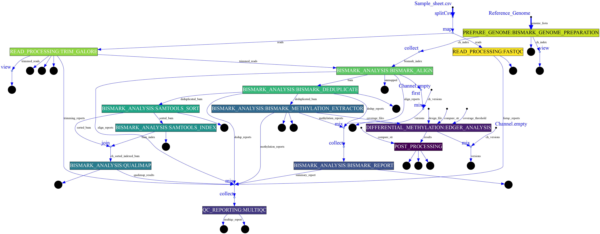

[](https://doi.org/10.5281/zenodo.14204261)
[](https://jyotirmoys-organization.gitbook.io/twistnext)
[](https://github.com/JD2112/TwistNext/settings/access)

## Overview

This Nextflow pipeline is designed for the analysis of Twist NGS Methylation data, including quality control, alignment, methylation calling, differential methylation analysis, and post-processing. It integrates various tools and custom scripts to provide a comprehensive analysis workflow.

## Features

| Step                                       | Workflow          |
| ------------------------------------------ | ----------------- |
| Generate Reference Genome Index (optional) | [Bismark](http://felixkrueger.github.io/Bismark/bismark/genome_preparation/)           |
| Raw data QC                                | [FastQC](https://www.bioinformatics.babraham.ac.uk/projects/fastqc/)            |
| Adapter sequence trimming                  | [Trim Galore](https://www.bioinformatics.babraham.ac.uk/projects/trim_galore/)       |
| Align Reads                                | [Bismark (bowtie2)](http://felixkrueger.github.io/Bismark/bismark/alignment/) |
| Deduplicate Alignments                     | [Bismark](http://felixkrueger.github.io/Bismark/bismark/deduplication/)           |
| Sort and indexing                          | [Samtools](http://www.htslib.org/)          |
| Extract Methylation Calls                  | [Bismark](http://felixkrueger.github.io/Bismark/bismark/methylation_extraction/)           |
| Sample Report                              | [Bismark](http://felixkrueger.github.io/Bismark/bismark/processing_report/)           |
| Summary Report                             | [Bismark](http://felixkrueger.github.io/Bismark/bismark/summary_report/)           |
| Alignment QC                               | [Qualimap](http://qualimap.conesalab.org/)          |
| QC Reporting                               | [MultiQC](https://seqera.io/multiqc/)           |
| Differential Methylation Analysis          | [EdgeR](https://bioconductor.org/packages/release/bioc/html/edgeR.html)/[MethylKit](https://www.bioconductor.org/packages/release/bioc/html/methylKit.html)   |
| Post processing                            | [ggplot2](https://ggplot2.tidyverse.org/)           |
| GO analysis                                | [Gene Ontology](https://geneontology.org)     |


## Pipeline Schema


## Requirements

- [Nextflow (>=21.10.3)](https://www.nextflow.io/docs/latest/install.html#install-nextflow)
- [Docker](https://docs.docker.com/engine/install/) or [Singularity](https://singularity-tutorial.github.io/01-installation/) (for containerized execution)
- Java (>=8)

## Usage

```
# when using the reference genome indexing, --genome_fasta

nextflow run main.nf \
    -profile singularity \
    --sample_sheet Sample_sheet_twist.csv \
    --genome_fasta /data/reference_genome/hg38/hg38.fa \ 
    --diff_meth_method edger \
    --outdir /mnt/Results/test_twistNext_dagTest_edgeR 


# if you already have the bisulfite genome index, --bismark_index

nextflow run main.nf \
    -profile singularity \
    --sample_sheet Sample_sheet_twist.csv \
    --bismark_index /data/reference_genome/hg38/ \ 
    --diff_meth_method edger \
    --outdir /mnt/Results/test_twistNext_dagTest_edgeR 
```

## HELP

```
nextflow run main.nf --help --outdir .
```
Find the details on the [manual](https://jyotirmoys-organization.gitbook.io/twistnext)

## Credits
- Main Author: 
    - Jyotirmoy Das ([@JD2112](https://github.com/JD2112))

- Collaborators: ()

## Citation

Das, J. (2024). TwistNext (v1.0.0). Zenodo. [https://doi.org/10.5281/zenodo.14204261](https://doi.org/10.5281/zenodo.14204261)

## HELP/FAQ/Troubleshooting

Please check the [manual](https://jyotirmoys-organization.gitbook.io/twistnext) for details.

Please create [issues](https://github.com/JD2112/TwistNext/issues) on github.

## License(s)

[GNU-3 public license](https://github.com/JD2112/TwistNext/blob/v1.0.3/LICENSE).

## Acknowledgement

We would like to acknowledge the **Core Facility, Faculty of Medicine and Health Sciences, Linköping University, Linköping, Sweden** and **Clinical Genomics Linköping, Science for Life Laboratory, Sweden** for their support.
