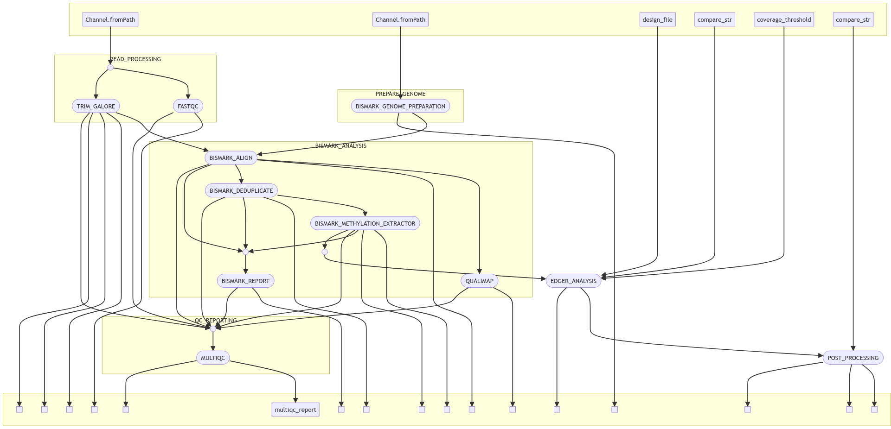

<!-- # Twist DNA Methylation Data Analysis Pipeline -->


## Overview

This Nextflow pipeline is designed for the analysis of Twist NGS Methylation data, including quality control, alignment, methylation calling, differential methylation analysis, and post-processing. It integrates various tools and custom scripts to provide a comprehensive analysis workflow.

## Features

| Step                                       | Workflow          |
| ------------------------------------------ | ----------------- |
| Generate Reference Genome Index (optional) | Bismark           |
| Raw data QC                                | FastQC            |
| Adapter sequence trimming                  | Trim Galore       |
| Align Reads                                | Bismark (bowtie2) |
| Deduplicate Alignments                     | Bismark           |
| Extract Methylation Calls                  | Bismark           |
| Sample Report                              | Bismark           |
| Summary Report                             | Bismark           |
| Alignment QC                               | Qualimap          |
| QC Reporting                               | MultiQC           |
| Differential Methylation Analysis          | EdgeR             |
| Post processing                            |                  ggplot2 |

## Pipeline Schema


## Requirements

- [Nextflow (>=21.10.3)](https://www.nextflow.io/docs/latest/install.html#install-nextflow)
- [Docker](https://docs.docker.com/engine/install/) or [Singularity](https://singularity-tutorial.github.io/01-installation/) (for containerized execution)
- Java (>=8)

## Usage

```
nextflow run https://github.com/jd21/TwistNext \
    -r main \
    -profile [docker, singularity] \
    --sample_sheet Sample_sheet.csv \
    --genome_fasta <PATH/TO/Reference Genome/hg38.fa> \
    --output results

```

## Input
- Reference genome in FASTA format
- Sample sheet (CSV format) with sample information

`Sample_sheet.csv`:

|sample_id  |group   |read1                                                            |read2                                                            |
|-----------|--------|-----------------------------------------------------------------|-----------------------------------------------------------------|
|SN09|Healthy |FASTQ/SN09/SL1_S9_R1_001.fastq.gz |FASTQ/SN09/SL1_S9_R2_001.fastq.gz |
|SN10|Disease|FASTQ/SN10/SL2_S10_R1_001.fastq.gz|FASTQ/SN10/SL2_S10_R2_001.fastq.gz|
|SN11|Healthy |FASTQ/SN11/SL3_S11_R1_001.fastq.gz|FASTQ/SN11/SL3_S11_R2_001.fastq.gz|
|SN12|Disease|FASTQ/SN12/SL4_S12_R1_001.fastq.gz|FASTQ/SN12/SL4_S12_R2_001.fastq.gz|
|SN13|Healthy |FASTQ/SN13/SL5_S13_R1_001.fastq.gz|FASTQ/SN13/SL5_S13_R2_001.fastq.gz|
|SN14|Disease|FASTQ/SN14/SL6_S14_R1_001.fastq.gz|FASTQ/SN14/SL6_S14_R2_001.fastq.gz|


## Parameters configuration
### Required parameters

- `--sample_sheet` (required) - provide the `sample_sheet.csv` same format as described above.

- `--genome_fasta` (required) - provide the full path of the reference genome sequence (`.fa` or `.fasta`).

- `--bismark_index` (optional) - full path of the `bismark` index file instead of `genome_fasta`.

- `outdir` (required) - full path of the output directory.

### Optional parameters
User can change it directly to `conf/params.config` or add to the `nextflow run` command.

- `--compare_str` (optional) - provide the string such as `Healthy_vs_Disease` (for pair-wise comparisons) or `all` (for multiple pair-wise comparisons). By default, the pipeline will calculate `all` from the `Sample_sheet.csv`.

- `--coverage_threshold` (optional) - for `EdgeR` calculation, user can set their own `coverage_threshold`. Default is `10`.

- `--multiqc_config` (optional) - user can configure `MultiQC` run.

- `--multiqc_title` (optional) - user can provide `MultiQC` title.

- `--post_processing` (optional) - <boolean> Default is `true` to run the post-processing steps. Can be set `false` to avoid it.

- `--qualimap_args` (optional) - can use [qualimap arguments](from http://qualimap.conesalab.org/doc_html/command_line.html)

### Default Bismark Alignment with Bowtie2

| Option              | Functionality                                                                 |
|---------------------|-------------------------------------------------------------------------------|
| `-q`                | Quiet mode: suppresses detailed output.                                      |
| `--score-min L,0,-0.2` | Sets a linear minimum score for valid alignments (moderate stringency).       |
| `--ignore-quals`    | Ignores base quality scores during alignment.                                |
| `--no-mixed`        | Ensures both ends of paired reads align properly; no single-end alignments.  |
| `--no-discordant`   | Prevents discordant alignments; enforces proper orientation and distance.    |
| `--dovetail`        | Allows overlapping or extended alignments in paired-end reads.              |
| `--maxins 500`      | Sets the maximum allowed distance between paired-end reads to 500 bases.    |


**NOTE:**
1. `conf/resource.config` - for resource settings.
2. `conf/base.config` - for base settings.
3. `nextflow.config` - for nextflow run with default setting.

## Credits
- Main Author: 
    - Jyotirmoy Das (@JD2112)
- Maintainers:

- Contributions:

## Citation

## HELP/FAQ/Troubleshooting

Please check the manual for details.

Please create issues on github.

## License(s)

GNU-3 public license - click to read details.

## Acknowledgement

We would like to acknowledge the **Core Facility, Faculty of Medicine and Health Sciences, Linköping University, Linköping, Sweden** and **Clinical Genomics Linköping, Science for Life Laboratory, Sweden** for their support.

