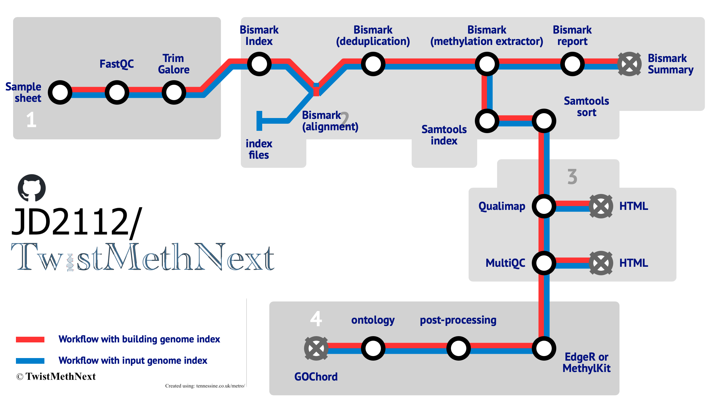

[](https://doi.org/10.5281/zenodo.14204261)
[](https://jyotirmoys-organization.gitbook.io/TwistMethNext)
[](https://github.com/JD2112/TwistMethNext/actions/workflows/build-docs.yml)
[](https://github.com/JD2112/TwistMethNext/settings/access)

[](https://wakatime.com/badge/user/fe95275f-909a-4147-a45d-624981173898/project/a44415f0-a274-4c3b-a59a-f8e1067c0fc1)

## Overview

This Nextflow pipeline is designed for the analysis of Twist NGS Methylation data, including quality control, alignment, methylation calling, differential methylation analysis, and post-processing. It integrates various tools and custom scripts to provide a comprehensive analysis workflow.

## Features

| Step                                       | Workflow          |
| ------------------------------------------ | ----------------- |
| Generate Reference Genome Index (optional) | [Bismark](http://felixkrueger.github.io/Bismark/bismark/genome_preparation/)           |
| Raw data QC                                | [FastQC](https://www.bioinformatics.babraham.ac.uk/projects/fastqc/)            |
| Adapter sequence trimming                  | [Trim Galore](https://www.bioinformatics.babraham.ac.uk/projects/trim_galore/)       |
| Align Reads                                | [Bismark (bowtie2)](http://felixkrueger.github.io/Bismark/bismark/alignment/) |
| Deduplicate Alignments                     | [Bismark](http://felixkrueger.github.io/Bismark/bismark/deduplication/)           |
| Sort and indexing                          | [Samtools](http://www.htslib.org/)          |
| Extract Methylation Calls                  | [Bismark](http://felixkrueger.github.io/Bismark/bismark/methylation_extraction/)           |
| Sample Report                              | [Bismark](http://felixkrueger.github.io/Bismark/bismark/processing_report/)           |
| Summary Report                             | [Bismark](http://felixkrueger.github.io/Bismark/bismark/summary_report/)           |
| Alignment QC                               | [Qualimap](http://qualimap.conesalab.org/)          |
| QC Reporting                               | [MultiQC](https://seqera.io/multiqc/)           |
| Differential Methylation Analysis          | [EdgeR](https://bioconductor.org/packages/release/bioc/html/edgeR.html)/[MethylKit](https://www.bioconductor.org/packages/release/bioc/html/methylKit.html)   |
| Post processing                            | [ggplot2](https://ggplot2.tidyverse.org/)           |
| GO analysis                                | [Gene Ontology](https://geneontology.org)     |


## Pipeline Schema


## Requirements

- [Nextflow (>=21.10.3)](https://www.nextflow.io/docs/latest/install.html#install-nextflow)
- [Docker](https://docs.docker.com/engine/install/) or [Singularity](https://singularity-tutorial.github.io/01-installation/) (for containerized execution)
- Java (>=8)

## Usage
1. User can start from the FASTQ files or Bismark aligned BAM files. Find the details on the [manual](https://jyotirmoys-organization.gitbook.io/TwistMethNext)

2. User can choose to run the differential methylation analysis - either EdgeR or MethylKit or both. Find the details on the [manual](https://jyotirmoys-organization.gitbook.io/TwistMethNext)

3. User can also use `--skip_diff_meth` to avoid the differential methylation analysis.

### `--run_both_methods`

```
# when using the reference genome indexing, --genome_fasta

nextflow run JD2112/TwistMethNext \
    -profile singularity \
    --sample_sheet Sample_sheet_twist.csv \
    --genome_fasta /data/reference_genome/hg38/hg38.fa \ 
    --run_both_methods \
    --gtf_file /data/Homo_sapiens.GRCh38.104.gtf \
    --refseq_file /data/hg38_RefSeq.bed.gz \
    --outdir Results/TwistMethNext_both 


# if you already have the bisulfite genome index, --bismark_index

nextflow run JD2112/TwistMethNext \
    -profile singularity \
    --sample_sheet Sample_sheet_twist.csv \
    --bismark_index /data/reference_genome/hg38/ \ 
    --run_both_methods \
    --gtf_file /data/Homo_sapiens.GRCh38.104.gtf \
    --refseq_file /data/hg38_RefSeq.bed.gz \    
    --outdir /mnt/Results/TwistMethNext_both
```


### `--diff_meth_method`: EdgeR

```
# when using the reference genome indexing, --genome_fasta

nextflow run JD2112/TwistMethNext \
    -profile singularity \
    --sample_sheet Sample_sheet_twist.csv \
    --genome_fasta /data/reference_genome/hg38/hg38.fa \ 
    --diff_meth_method edger \
    --refseq_file /data/hg38_RefSeq.bed.gz \
    --outdir Results/TwistMethNext_edgeR 


# if you already have the bisulfite genome index, --bismark_index

nextflow run JD2112/TwistMethNext \
    -profile singularity \
    --sample_sheet Sample_sheet_twist.csv \
    --bismark_index /data/reference_genome/hg38/ \ 
    --diff_meth_method edger \
    --refseq_file /data/hg38_RefSeq.bed.gz \
    --outdir /mnt/Results/TwistMethNext_edgeR 
```

### `--diff_meth_method`: MethylKit

```
# when using the reference genome indexing, --genome_fasta

nextflow run JD2112/TwistMethNext \
    -profile singularity \
    --sample_sheet Sample_sheet_twist.csv \
    --genome_fasta /data/reference_genome/hg38/hg38.fa \ 
    --diff_meth_method methylkit \
    --gtf_file /data/Homo_sapiens.GRCh38.104.gtf \
    --outdir Results/TwistMethNext_methylKit 


# if you already have the bisulfite genome index, --bismark_index

nextflow run JD2112/TwistMethNext \
    -profile singularity \
    --sample_sheet Sample_sheet_twist.csv \
    --bismark_index /data/reference_genome/hg38/ \ 
    --diff_meth_method methylkit \
    --gtf_file /data/Homo_sapiens.GRCh38.104.gtf \
    --outdir Results/TwistMethNext_methylKit 
```
## Options:

| options | Description |
|--------|-----------------------------------------------------------|
| `--sample_sheet`       | Path to the sample sheet CSV file (required) |                                           
| `--bismark_index`      | Path to the Bismark index directory (required unless `--genome` or `--aligned_bams` is provided) |
| `--genome`             | Path to the reference genome FASTA file (required if `--bismark_index` not provided)| 
| `--aligned_bams`       | Path to aligned BAM files (use this to start from aligned BAM files instead of FASTQ files) |
| `--refseq_file`        | Path to RefSeq file for annotation (reuired to run `both` or `methylkit`)  |
| `--gtf_file`           | Path to GTF file for annotation (reuired to run `both` or `edger`)  |
| `--outdir`             | Output directory (default: ./results) |
| `--diff_meth_method`   | Differential methylation method to use: 'edger' or 'methylkit' (default: edger) | 
| `--run_both_methods`   | Run both edgeR and methylkit for differential methylation analysis (default: false) | 
| `--skip_diff_meth`     | Skip differential methylation analysis (default: false)   | 
| `--coverage_threshold` | Minimum read coverage to consider a CpG site (default: 10) |
| `--logfc_cutoff`       | Differential methylation cut-off for Volcano or MA plot (default: 1.5)    |  
| `--pvalue_cutoff`      | Differential methylation P-value cut-off for Volcano or MA plot (default: 0.05)      | 
| `--hyper_color`        | Hypermethylation color for Volcano or MA plot (default: red) |
| `--hypo_cutoff`        | Hypomethylation color for Volcano or MA plot (default: blue) |
| `--nonsig_color`       | Non-significant color for Volcano or MA plot (default: black) |
| `--compare_str`        | Comparison string for differential analysis (e.g. "Group1-Group2")  |
| `--top_n_genes`        | Number of top differentially methylated genes to report for GOplot (default: 100) |
| `--help`               | Show this help message and exit   | 


## HELP

```
nextflow run JD2112/TwistMethNext --help --outdir .
```
Find the details on the [manual](https://jd2112.github.io/TwistMethNext/)

## Credits
- Main Author: 
    - Jyotirmoy Das ([@JD2112](https://github.com/JD2112))

- Collaborators:
    - Debojyoti Das ([@BioDebojyoti](https://github.com/BioDebojyoti))    

## Citation

Das, J. (2024). TwistMethNext (v1.0.0). Zenodo. [https://doi.org/10.5281/zenodo.14204261](https://doi.org/10.5281/zenodo.14204261)

## HELP/FAQ/Troubleshooting

Please check the [manual](https://jd2112.github.io/TwistMethNext/) for details.

Please create [issues](https://github.com/JD2112/TwistMethNext/issues) on github.

## License(s)

[GNU-3 public license](https://github.com/JD2112/TwistMethNext/blob/v1.0.3/LICENSE).

## Acknowledgement

We would like to acknowledge the **Core Facility, Faculty of Medicine and Health Sciences, Linköping University, Linköping, Sweden** and **Clinical Genomics Linköping, Science for Life Laboratory, Sweden** for their support. We are grateful to **PDC (KTH, Sweden)** support for computational support to test and validate the pipeline on the *Dardel* HPC.
