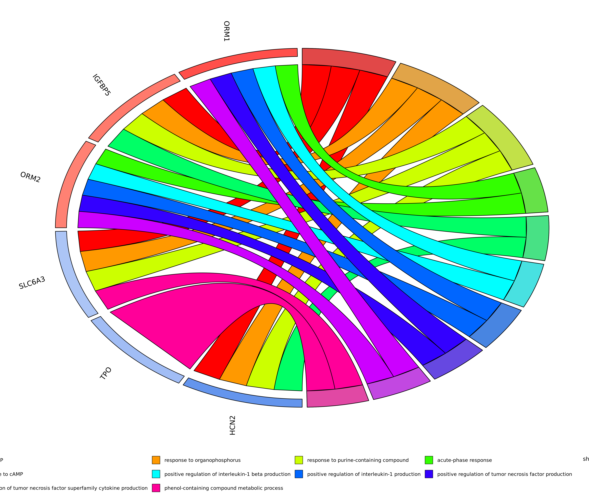

# Gene Ontology analysis

The pipeline has also a module to perform the Gene Ontology analysis from the top `n` corresponding genes from the differential methylation results (EdgeR/MethylKit) using the _clusterProfiler_ package.

The results generates a full table with all _Biological Processes_ and a _Chord diagram_ with top 10 functions identified in the analysis.

**GOChord diagram**

<figure><figcaption>
GO chord from the GO analysis using the default parameters
</figcaption></figure>
