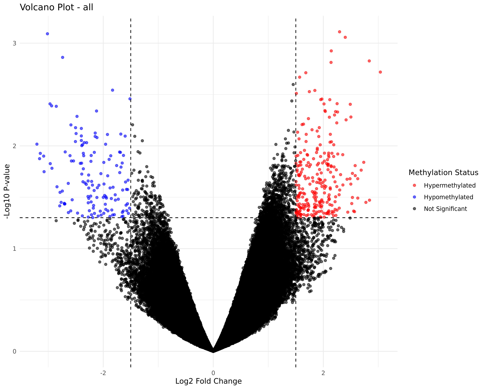
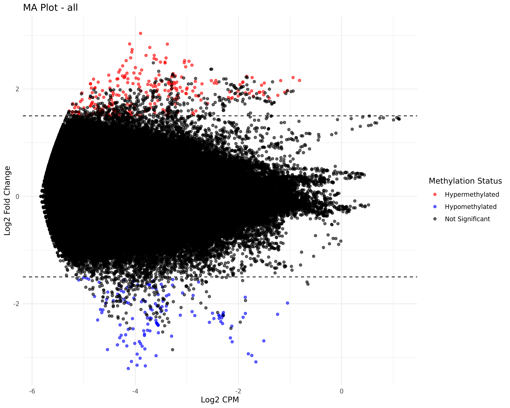

# Post-processing

Generates A) **Volcano Plot,** B) **MA Plot** and C) **Summary Statistics** from the Diffrential Methylation results.

**Volcano Plot**

<figure><figcaption>
Volcano plot using the default logFC and pvalue cutoff
</figcaption></figure>

**MA Plot**

<figure><figcaption>
MA plot using the default parameters
</figcaption></figure>

