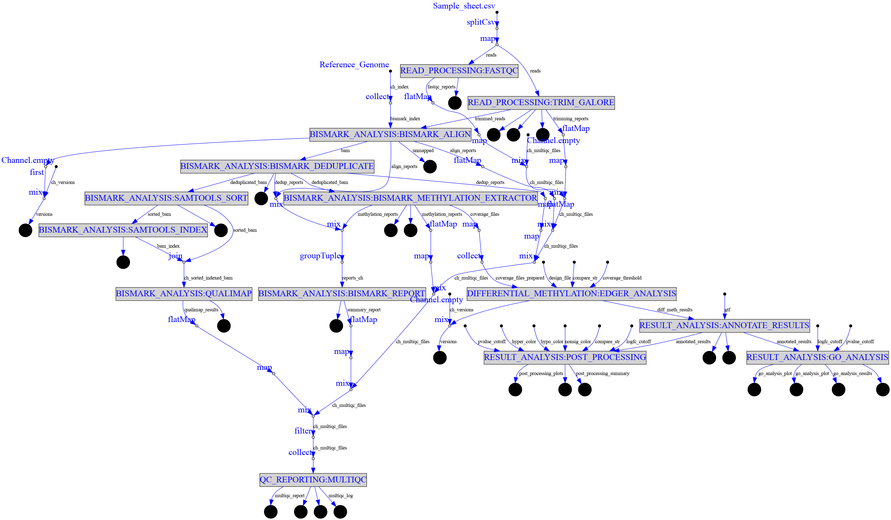
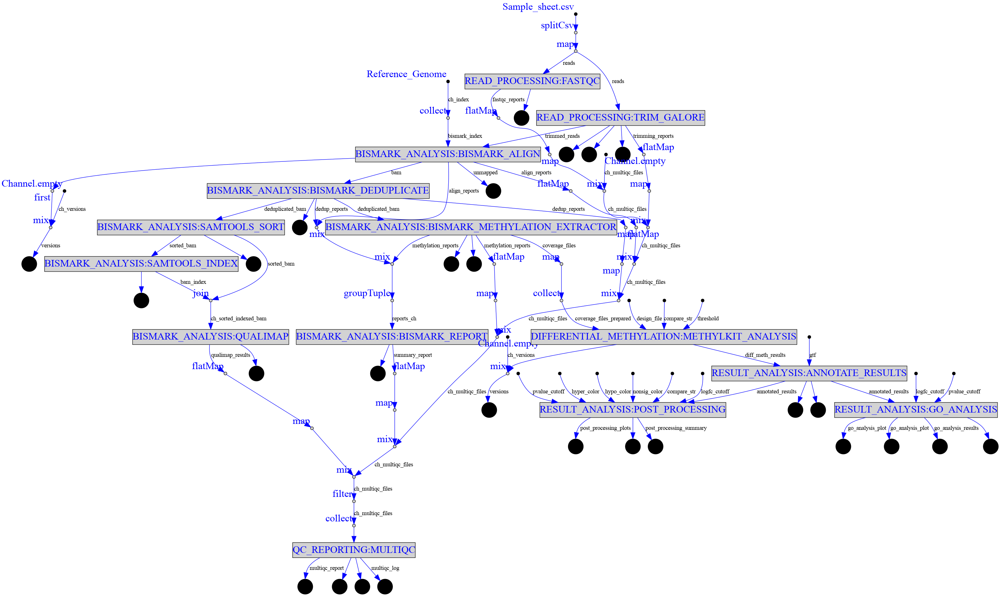

# Highlights

Here's a comprehensive overview of TwistNext DNA methylation sequencing analysis pipeline:

1. **READ\_PROCESSING:**
   * **FASTQC:** Performs quality control checks on raw sequence data.
   * **TRIM\_GALORE:** Trims adapters and low-quality bases from the reads.
2. **BISMARK\_ANALYSIS:**
   * **BISMARK\_ALIGN**: Aligns bisulfite-treated reads to a reference genome.
   * **BISMARK\_DEDUPLICATE:** Removes PCR duplicates from the aligned reads.
   * **SAMTOOLS\_SORT**: Sorts the aligned and deduplicated BAM files.
   * **SAMTOOLS\_INDEX:** Indexes the sorted BAM files for efficient access.
   * **QUALIMAP:** Generates quality control metrics for the aligned reads.
   * **BISMARK\_METHYLATION\_EXTRACTOR:** Extracts methylation calls from the aligned reads.
   * **BISMARK\_REPORT**: Generates a summary report of the Bismark alignment and methylation extraction.
3. **QC\_REPORTING:**
   * **MULTIQC**: Aggregates quality control reports from various steps into a single report.
4. D**IFFERENTIAL\_METHYLATION**:
   * **EDGER\_ANALYSIS**: Performs differential methylation analysis using the EdgeR package.
   * **METHYLKIT\_ANALYSIS**: Performs differential methylation analysis using the methylKit package.
5. **POST\_PROCESSING:** Generates summary statistics and visualizations of the differential methylation results.
6. **GO\_ANALYSIS:** Generates GOChord diagram from the gene ontology analysis results.&#x20;

<figure><figcaption>
DAG for EdgeR workflow
</figcaption></figure>

<figure><figcaption>
DAG for MethylKit workflow
</figcaption></figure>
