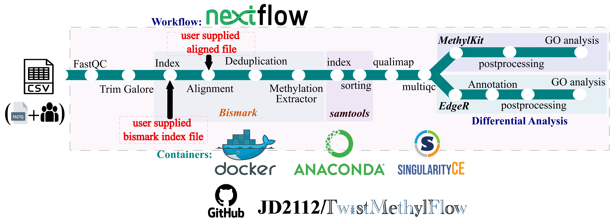

# TwistMethylFlow Documentation

Welcome to the TwistMethylFlow documentation. This Nextflow pipeline is designed for the analysis of Twist NGS Methylation data, encompassing quality control, alignment, methylation calling, differential methylation analysis, and post-processing.

For a detailed overview, please refer to the [Overview](overview.md) section.