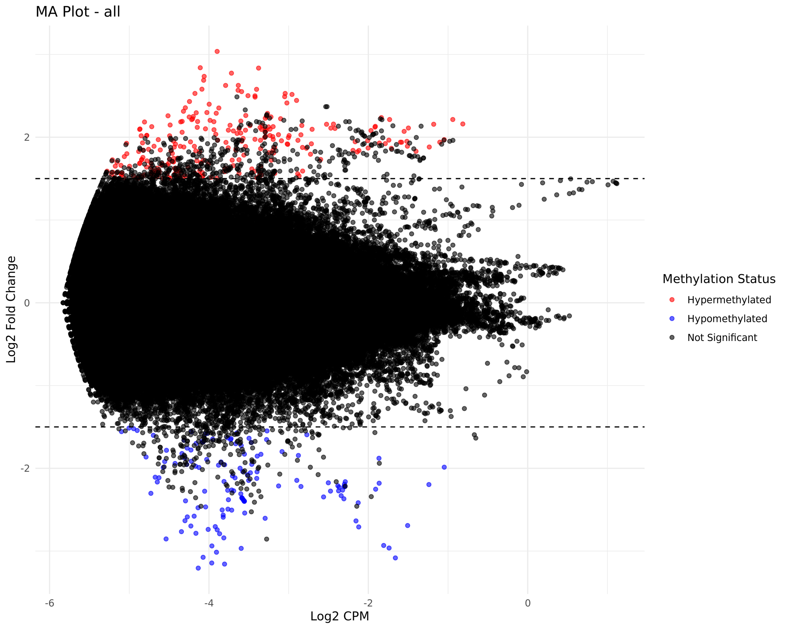
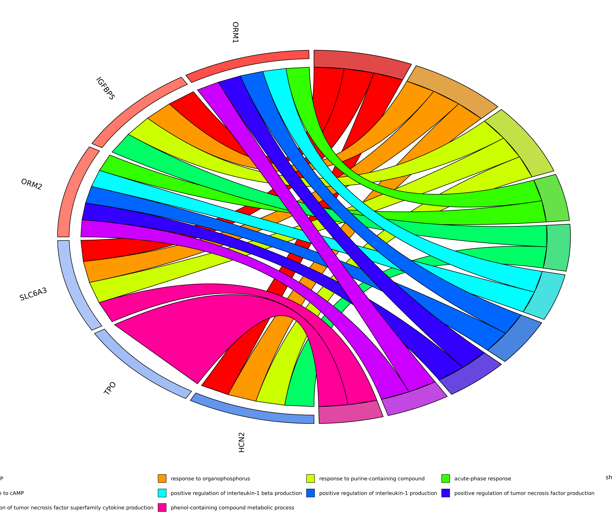

TwistMethylFlow integrates various tools and custom scripts to provide a comprehensive analysis workflow for Twist NGS Methylation data.

| Step                      | Tool/Software                                                                                                                                                | Description                                                                                  |
|---------------------------|--------------------------------------------------------------------------------------------------------------------------------------------------------------|----------------------------------------------------------------------------------------------|
| Generate Reference Genome | [Bismark](https://www.bioinformatics.babraham.ac.uk/projects/bismark/)                                                                                       | Generate reference genome index files for bismark.                                           |
| Raw Data QC               | [FastQC](https://www.bioinformatics.babraham.ac.uk/projects/fastqc/)                                                                                         | Performs quality control checks on raw sequence data.                                        |
| Adapter Trimming          | [Trim Galore](https://www.bioinformatics.babraham.ac.uk/projects/trim_galore/)                                                                               | Trims adapters and low-quality bases from the reads.                                         |
| Align Reads               | [Bismark (bowtie2)](https://www.bioinformatics.babraham.ac.uk/projects/bismark/)                                                                             | Aligns bisulfite-treated reads to a reference genome.                                        |
| Deduplicate removal       | [Bismark](https://www.bioinformatics.babraham.ac.uk/projects/bismark/)                                                                                       | Removes PCR duplicates from the aligned reads.                                               |
| Sort and Indexing         | [Samtools](http://www.htslib.org/)                                                                                                                           | Sorts the aligned and deduplicated BAM files.                                                |
| Extract Methylation Calls | [Bismark](https://www.bioinformatics.babraham.ac.uk/projects/bismark/)                                                                                       | Extracts methylation calls from the aligned reads.                                           |
| Summary Report            | [Bismark](https://www.bioinformatics.babraham.ac.uk/projects/bismark/)                                                                                       | Generates a summary report of the Bismark alignment and <br>methylation extraction.          |
| Alignment QC              | [Qualimap](http://qualimap.conesalab.org/)                                                                                                                   | Generates quality control metrics for the aligned reads.                                     |
| QC Reporting              | [MultiQC](https://multiqc.info/)                                                                                                                             | Aggregates quality control reports from various steps <br>into a single report.              |
| Differential Methylation  | [EdgeR](https://bioconductor.org/packages/release/bioc/html/edgeR.html), <br>[MethylKit](https://bioconductor.org/packages/release/bioc/html/methylKit.html) | Performs differential methylation analysis using EdgeR <br>and MethylKit package.            |
| Post Processing           | [ggplot2](https://ggplot2.tidyverse.org/)                                                                                                                    | Generates summary statistics and visualizations of the <br>differential methylation results. |
| GO Analysis               | [Gene Ontology](http://geneontology.org/)                                                                                                                    | Generates GOChord diagram from gene ontology analysis results.                               |

## Feature Details

1. **READ\_PROCESSING:** Checks the quality of raw sequencing data and trims low-quality bases and adapters to improve downstream analysis.
2. **BISMARK\_ANALYSIS:** Aligns bisulfite-converted reads to a reference genome, identifies and removes PCR duplicates, sorts and indexes the aligned reads, performs quality control on alignments, and extracts methylation information from the aligned reads.
3. **QC\_REPORTING:** Compiles quality control metrics from various steps into a comprehensive report for easy interpretation.
4. **DIFFERENTIAL\_METHYLATION:**
   * _EDGER\_ANALYSIS:_
     * Takes coverage files, a design file, and comparison information as input.
     * Performs differential methylation analysis using the EdgeR Bioconductor package.
     * Outputs CSV files with differential methylation results for each group comparison. _METHYLKIT\_ANALYSIS:_
     * Takes coverage files, a design file, and comparison information as input.
     * Performs differential methylation analysis using the EdgeR Bioconductor package.
     * Outputs CSV files with differential methylation results for each group comparison.
5. **POST\_PROCESSING:**
   * Reads the EdgeR results and generates:
     * Summary statistics (total DMRs, hyper/hypomethylated regions, significant DMRs)
     * Volcano plot (visualizing fold change vs. significance)
     * MA plot (visualizing intensity vs. fold change)
6. **Functional Analsysis**

* Reads the EdgeR/MethylKit results and generates -&#x20;
  * Top `n` corresponding genes from the EdgeR/MethylKit results are picked up to generate the gene ontology results.
  * generates a CSV file with the GO classification results (only **Biological Processes).**
  * generates a **Chord diagram** for top 10 results from the GO analysis.


### 1. Read processing

Read processing subworkflow includes -&#x20;

* FASTQC - for Quality check of samples
* TRIM Galore - adapter trimming

#### 1.1 FastQC

**FASTQC** is a widely used tool for assessing the quality of raw and processed sequencing data. It provides a comprehensive quality check, including metrics like per-base quality scores, GC content, and adapter contamination.

```
fastqc $args --threads $task.cpus $reads
```

**General Options**

* `<file{R1,R2}.fastq>`: Input FASTQ files (gzip-compressed files, e.g., `file1.fastq.gz`, are also supported).
* `-o <output_directory>`: Specify the directory where reports will be saved. Defaults to the current directory if omitted.
* `-t <number_of_threads>`: Specify the number of threads for parallel processing.


??? note "FASTQC Results"
    1. **HTML Report**: Visual summary of the quality metrics.
    2. **ZIP File**: Contains the raw data used to generate the report.

    Key metrics in the HTML report:

    * **Per Base Sequence Quality**:
    * Boxplots showing quality scores across all positions in reads.
    * Green indicates high-quality bases (>Q30).
    * **Per Sequence Quality Scores**:
    * Overall quality of reads in the file.
    * **Per Base GC Content**:
    * GC content distribution across the length of reads.
    * **Adapter Content**:
    * Detects overrepresented adapter sequences.
    * **Overrepresented Sequences**:
    * Identifies frequently occurring sequences (e.g., adapters or contaminants).


#### 1.2 Trim Galore

**Trim Galore** is a versatile tool for trimming sequencing reads and removing adapter sequences. It’s particularly useful for preparing raw sequencing data for downstream applications like alignment or differential expression/methylation analysis. Trim Galore combines the functionalities of **Cutadapt** and **FastQC** for quality control and trimming.

```
trim_galore --paired --cores $task.cpus $args $reads
```

**General Options**

* `-q <quality>`: Trim low-quality bases from the ends of reads. Default is `20`.
* `--length <min_length>`: Discard reads shorter than the specified length after trimming.
* `--adapter <sequence>`: Specify a custom adapter sequence. By default, Trim Galore auto-detects adapters.
* `--gzip`: Compress the output files into `.gz` format.
* `--fastqc`: Run **FastQC** before and after trimming.
* `--cores <number>`: Use multiple cores for faster processing.

### 2. Bismark Analysis

#### 2.1 Reference Genome Preparation

Bismark needs to prepare the bisulfite index for the genome.

* In the current pipeline, user can provide the `genome.fasta` and the pipeline can index it.
* Optinally, user can provide the index files directly, and the pipeline will use it without indexing the genome again.

**General Options**

* `--verbose`: Prints detailed output during the indexing process.
* `--parallel <threads>`: Uses multiple threads to speed up genome preparation.
* `--bowtie2`: Specifies that **Bowtie2** will be used for alignment (default option in most versions).
* `--path_to_bowtie <path>`: Specifies the path to the Bowtie installation if not in your `PATH`.

**Example with Options:**

```bash
bismark_genome_preparation --bowtie2 --parallel 4 <genome.fasta>
```

??? note "Reference Genome Preparation"
    After successful completion, Bismark generates a bisulfite-converted genome in two orientations (C->T and G->A) along with the Bowtie/Bowtie2 indices.

    Output directory structure:

    ```plaintext
    your_path_to_reference/
        Bisulfite_Genome/
            CT_conversion/
            GA_conversion/
            genome.1.bt2
            genome.2.bt2
            ...
    ```

#### 2.2 Bismark Alignment

This step aligns bisulfite-treated sequencing reads to a reference genome.

```
bismark --genome <path_to_reference_genome> -1 <reads_R1.fq> -2 <reads_R2.fq> -o <output_directory>
```

**General Options**
  * `--genome`: Path to the reference genome directory preprocessed with `bismark_genome_preparation`.
  * `-1` and `-2`: Specify paired-end reads. Use `-U` for single-end reads.
  * `-o`: Output directory for alignment files.

??? note "Bismark Alignment"
  * Produces `.bam`  alignment files.
  * Produces `.report.txt`  and
  * `unmapped_reads.fq.gz` file.

#### 2.3 Bismark Deduplication
This step removes duplicate reads to avoid overestimating methylation levels.

```
deduplicate_bismark ${paired_end} $args --bam $bam
```

**General options:**
  * `args` options use all arguments from bismark deduplicate command.
  * `--paired`: Use this for paired-end data. Remove for single-end reads.
  * `--bam`: Specifies the input BAM file, generated from `bismark alignment`

??? note "Bismark Deduplicate Removal"
  * Generates a deduplicated `.bam` file.
  * Produces `deduplicated_report.txt` file.


#### 2.4 Bismark Methylation Extractor

Extract methylation data from deduplicated BAM files.

```bash
bismark_methylation_extractor \
    --bedGraph --gzip \
    -o <output_directory> <deduplicated.bam>
```

**General options:**
  * `--bedGraph`: Generates bedGraph file
  * `--gzip`: Compresses the output files.

??? note "Bismark Methylation Extractor"
  * Generates `.bismark.cov.gz` files and methylation call data in CpG, CHG, and CHH contexts.
  * Generates `bedGraph.gz` file.
  * Also generates `splitting_report.txt` file.


#### 2.5 Bismark Report
Generate a summary report of alignment and methylation statistics.

**Command:**

```bash
bismark2report
```

??? note "Bismark Report"
    Produces an HTML file summarizing:
        * Alignment efficiency.
        * Duplicate rates.
        * Methylation levels (CpG, CHG, CHH contexts).

### 3. Alignment Quality Mapping

The main module for assessing alignment quality is `qualimap bamqc`.

```bash
qualimap bamqc \
    -bam <input.bam> \
    -outdir <output_directory> \
    -outformat <html> \
    --java-mem-size
```

**General Options:**
  * `-bam <input.bam>`: Path to the aligned BAM file (e.g., deduplicated BAM file).
  * `-outdir <output_directory>`: Directory for output reports.
  * `-outformat <pdf|html>`: Choose the output format for the report.

??? note "Alignment Quality Check"
    The output includes:

    1. **General Alignment Statistics**:
       * Total number of reads.
       * Percentage of mapped reads.
       * Percentage of properly paired reads (for paired-end data).
    2. **Coverage Statistics**:
       * Mean coverage depth.
       * Percentage of the genome covered at varying depths (e.g., 1x, 5x, 10x).
    3. **Insert Size Distribution** (for paired-end reads):
       * Provides insights into library preparation and sequencing quality.
    4. **GC Content Distribution**:
       * Checks for bias in GC content distribution compared to expected values.
    5. **Read Quality Metrics**:
       * Distribution of mapping quality scores.


### 4. QC Reporting

_MultiQC_ is used for the QC reporting combining all results from the _FastQC, Trim galore, Bismark Alignment, Bismark Deduplication, Bismark summary report,_ and _Qualimap results._

**Output**:

* Generates an interactive HTML report (`multiqc_report.html`) and a data file (`multiqc_data.json`).
* Output includes summary statistics, plots, and tool-specific metrics.

### 5. Differential Methylation Analysis
To calculate the differential methylation from the input samples, two different methods can be used -&#x20;

* [EdgeR](#edger) (Default) or
* [MethylKit](#methylkit)

#### 5.1 EdgeR

**edgeR** is a Bioconductor package primarily used for RNA-seq differential expression analysis but can also handle differential methylation analysis when paired with bisulfite sequencing data. This requires pre-processed methylation data, such as counts of methylated (`M`) and unmethylated (`U`) reads at each cytosine position or region of interest.

```
Rscript $baseDir/bin/edgeR_analysis.R \
        --coverage_files '${coverage_files}' \
        --design "${design_file}" \
        --compare "${compare_str}" \
        --output . \
        --threshold ${coverage_threshold}
```

**General options**

* `--coverage_files:` selected from the `bismark_methylation_extractor` files.
* `--design`: selected from the `Sample_sheet.csv`&#x20;
* `--compare`: selected from the `Sample_sheet.csv` .

??? note "EdgeR Results"
    * Generates `EdgeR_group_<compare_str>.csv`.


#### 5.2 MethylKit
**MethylKit** is an R package designed for analyzing bisulfite sequencing data, particularly for differential methylation analysis. It supports genome-wide methylation data and is ideal for CpG, CHH, and CHG methylation studies.

```
Rscript $baseDir/bin/run_methylkit.R \
        --coverage_files '${coverage_files}' \
        --design "${design_file}" \
        --compare "${compare_str}" \
        --output . \
        --threshold ${coverage_threshold}
```

**General options**

* `--coverage_files:` selected from the `bismark_methylation_extractor` files.
* `--design`: selected from the `Sample_sheet.csv`&#x20;
* `--compare`: selected from the `Sample_sheet.csv` .

??? note "MethylKit Results"
    * Generates `Methylkit_group_<compare_str>.csv` 

### 6. Post-processing

Generates A) **Volcano Plot,** B) **MA Plot** and C) **Summary Statistics** from the Diffrential Methylation results.

??? note "Figures"
    **Volcano Plot**
    

    **MA plot**
    


### 7. Gene Ontology Analysis
The pipeline has also a module to perform the Gene Ontology analysis from the top `n` corresponding genes from the differential methylation results (EdgeR/MethylKit) using the _clusterProfiler_ package.

The results generates a full table with all _Biological Processes_ and a _Chord diagram_ with top 10 functions identified in the analysis.

??? note "GOchord Diagram"

    